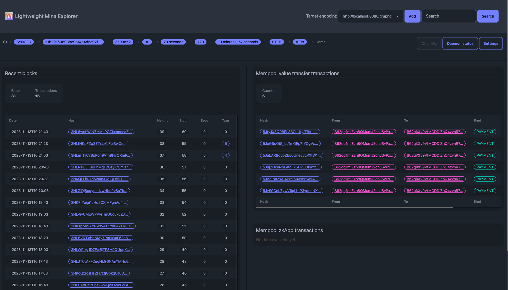

# Lightweight Mina Explorer

## Run

- Simply checkout the repository and open `index.html` in your web-browser.
- Or, alternatively, run `node server.js` in the root directory and open `http://localhost:3000` in your web-browser.

## View examples

